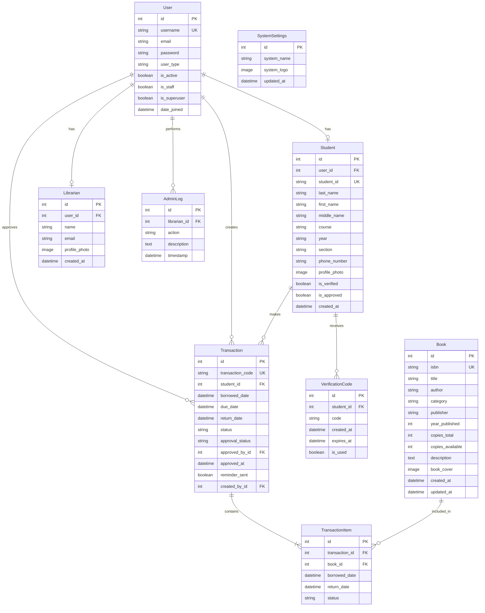
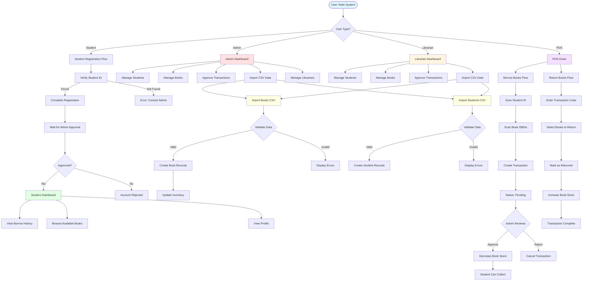

# Library Management System - Database Documentation

## Table of Contents
1. [Entity Relationship Diagram (ERD)](#entity-relationship-diagram-erd)
2. [Database Schema](#database-schema)
3. [Database Flow Chart](#database-flow-chart)
4. [Table Relationships](#table-relationships)

---

## Entity Relationship Diagram (ERD)

The following diagram shows all database tables and their relationships:



---

## Database Schema

### 1. User Table (auth_user)
Custom user authentication table extending Django's AbstractBaseUser.

| Column | Type | Constraints | Description |
|--------|------|-------------|-------------|
| id | INTEGER | PRIMARY KEY | Auto-incrementing user ID |
| username | VARCHAR(100) | UNIQUE, NOT NULL | Unique username for login |
| email | VARCHAR(254) | NULLABLE | User's email address |
| password | VARCHAR(128) | NOT NULL | Hashed password |
| user_type | VARCHAR(10) | NOT NULL | Type: 'student', 'admin', 'librarian', or 'pos' |
| is_active | BOOLEAN | DEFAULT TRUE | Account activation status |
| is_staff | BOOLEAN | DEFAULT FALSE | Staff status for admin access |
| is_superuser | BOOLEAN | DEFAULT FALSE | Superuser privileges |
| date_joined | DATETIME | NOT NULL | Account creation timestamp |
| last_login | DATETIME | NULLABLE | Last login timestamp |

**Indexes:**
- PRIMARY KEY on `id`
- UNIQUE INDEX on `username`

---

### 2. Student Table (library_student)
Extended profile information for student users.

| Column | Type | Constraints | Description |
|--------|------|-------------|-------------|
| id | INTEGER | PRIMARY KEY | Auto-incrementing student record ID |
| user_id | INTEGER | FOREIGN KEY, UNIQUE, NULLABLE | References User.id (OneToOne) |
| student_id | VARCHAR(50) | UNIQUE, NOT NULL | Institution student ID number |
| last_name | VARCHAR(100) | NOT NULL | Student's last name |
| first_name | VARCHAR(100) | NOT NULL | Student's first name |
| middle_name | VARCHAR(100) | NULLABLE | Student's middle name |
| course | VARCHAR(100) | NOT NULL | Academic course/program |
| year | VARCHAR(20) | NOT NULL | Year level (1, 2, 3, 4) |
| section | VARCHAR(20) | NOT NULL | Section/class designation |
| phone_number | VARCHAR(20) | NULLABLE | Contact phone number |
| profile_photo | VARCHAR(100) | NULLABLE | Path to profile photo (media/profile_photos/) |
| is_verified | BOOLEAN | DEFAULT FALSE | Email verification status |
| is_approved | BOOLEAN | DEFAULT FALSE | Admin approval status |
| created_at | DATETIME | NOT NULL | Record creation timestamp |

**Indexes:**
- PRIMARY KEY on `id`
- UNIQUE INDEX on `student_id`
- FOREIGN KEY on `user_id` → User.id

**Business Rules:**
- Students can register with a valid `student_id` that exists in the system
- Requires admin approval before account activation
- Can exist without a user account (for CSV imports before registration)

---

### 3. Book Table (library_book)
Catalog of all books in the library system.

| Column | Type | Constraints | Description |
|--------|------|-------------|-------------|
| id | INTEGER | PRIMARY KEY | Auto-incrementing book record ID |
| isbn | VARCHAR(20) | UNIQUE, NOT NULL | International Standard Book Number |
| title | VARCHAR(200) | NOT NULL | Book title |
| author | VARCHAR(200) | NOT NULL | Book author(s) |
| category | VARCHAR(100) | NOT NULL | Book category/genre |
| publisher | VARCHAR(200) | NULLABLE | Publishing company |
| year_published | INTEGER | NULLABLE | Year of publication |
| copies_total | INTEGER | DEFAULT 1, NOT NULL | Total number of copies owned |
| copies_available | INTEGER | DEFAULT 1, NOT NULL | Number of copies currently available |
| description | TEXT | NULLABLE | Book description/summary |
| book_cover | VARCHAR(100) | NULLABLE | Path to book cover image (media/book_covers/) |
| created_at | DATETIME | NOT NULL | Record creation timestamp |
| updated_at | DATETIME | NOT NULL | Last modification timestamp |

**Indexes:**
- PRIMARY KEY on `id`
- UNIQUE INDEX on `isbn`
- INDEX on `category` (for filtering)

**Business Rules:**
- ISBN must be unique (no duplicate books)
- `copies_available` is calculated dynamically: `copies_total - currently_borrowed`
- Book cover images are optional and NOT included in CSV imports
- `copies_available` must never be negative

---

### 4. Transaction Table (library_transaction)
Groups of books borrowed together by a student.

| Column | Type | Constraints | Description |
|--------|------|-------------|-------------|
| id | INTEGER | PRIMARY KEY | Auto-incrementing transaction ID |
| transaction_code | VARCHAR(50) | UNIQUE, NOT NULL | Unique transaction identifier |
| student_id | INTEGER | FOREIGN KEY, NOT NULL | References Student.id |
| borrowed_date | DATETIME | DEFAULT NOW, NOT NULL | Date books were borrowed |
| due_date | DATETIME | NOT NULL | Date books are due back |
| return_date | DATETIME | NULLABLE | Actual return date (NULL if not returned) |
| status | VARCHAR(10) | NOT NULL | 'borrowed' or 'returned' |
| approval_status | VARCHAR(10) | NOT NULL | 'pending', 'approved', or 'rejected' |
| approved_by_id | INTEGER | FOREIGN KEY, NULLABLE | References User.id (admin/librarian) |
| approved_at | DATETIME | NULLABLE | Approval timestamp |
| reminder_sent | BOOLEAN | DEFAULT FALSE | Email reminder sent flag |
| created_by_id | INTEGER | FOREIGN KEY, NULLABLE | References User.id (POS operator) |

**Indexes:**
- PRIMARY KEY on `id`
- UNIQUE INDEX on `transaction_code`
- FOREIGN KEY on `student_id` → Student.id
- FOREIGN KEY on `approved_by_id` → User.id
- FOREIGN KEY on `created_by_id` → User.id
- INDEX on `status`, `approval_status` (for filtering)

**Business Rules:**
- Transaction code format: `{SCHOOL_CODE}{5_RANDOM_DIGITS}{TIMESTAMP}`
- Multiple books can be borrowed in a single transaction
- Requires admin/librarian approval before inventory update
- Transaction status becomes 'returned' when all items are returned

---

### 5. TransactionItem Table (library_transactionitem)
Individual book records within a transaction (many-to-many through table).

| Column | Type | Constraints | Description |
|--------|------|-------------|-------------|
| id | INTEGER | PRIMARY KEY | Auto-incrementing item ID |
| transaction_id | INTEGER | FOREIGN KEY, NOT NULL | References Transaction.id |
| book_id | INTEGER | FOREIGN KEY, NOT NULL | References Book.id |
| borrowed_date | DATETIME | DEFAULT NOW, NOT NULL | Date this book was borrowed |
| return_date | DATETIME | NULLABLE | Date this book was returned |
| status | VARCHAR(10) | NOT NULL | 'borrowed' or 'returned' |

**Indexes:**
- PRIMARY KEY on `id`
- FOREIGN KEY on `transaction_id` → Transaction.id (CASCADE DELETE)
- FOREIGN KEY on `book_id` → Book.id
- INDEX on `status` (for filtering)

**Business Rules:**
- Deleting a transaction deletes all its items (CASCADE)
- Each item tracks individual book return separately (supports partial returns)
- When item status changes to 'returned', book's `copies_available` increases

---

### 6. VerificationCode Table (library_verificationcode)
Email verification codes for student registration.

| Column | Type | Constraints | Description |
|--------|------|-------------|-------------|
| id | INTEGER | PRIMARY KEY | Auto-incrementing code ID |
| student_id | INTEGER | FOREIGN KEY, NOT NULL | References Student.id |
| code | VARCHAR(6) | NOT NULL | 6-digit verification code |
| created_at | DATETIME | NOT NULL | Code generation timestamp |
| expires_at | DATETIME | NOT NULL | Code expiration timestamp (15 min) |
| is_used | BOOLEAN | DEFAULT FALSE | Whether code has been used |

**Indexes:**
- PRIMARY KEY on `id`
- FOREIGN KEY on `student_id` → Student.id

**Business Rules:**
- Codes expire after 15 minutes
- One-time use only (`is_used` flag)
- Generated as 6 random digits

---

### 7. Librarian Table (library_librarian)
Profile information for librarian users.

| Column | Type | Constraints | Description |
|--------|------|-------------|-------------|
| id | INTEGER | PRIMARY KEY | Auto-incrementing librarian ID |
| user_id | INTEGER | FOREIGN KEY, UNIQUE, NOT NULL | References User.id (OneToOne) |
| name | VARCHAR(200) | NOT NULL | Librarian's full name |
| email | VARCHAR(254) | NOT NULL | Contact email |
| profile_photo | VARCHAR(100) | NULLABLE | Path to profile photo (media/librarian_photos/) |
| created_at | DATETIME | NOT NULL | Record creation timestamp |

**Indexes:**
- PRIMARY KEY on `id`
- FOREIGN KEY on `user_id` → User.id (UNIQUE)

**Business Rules:**
- Only admins can create librarian accounts
- Librarians can manage students and books
- Librarians can import/export data
- Librarians cannot create other librarian accounts

---

### 8. SystemSettings Table (library_systemsettings)
System-wide configuration (singleton pattern).

| Column | Type | Constraints | Description |
|--------|------|-------------|-------------|
| id | INTEGER | PRIMARY KEY | Always 1 (singleton) |
| system_name | VARCHAR(200) | DEFAULT 'Library Management System' | Display name |
| system_logo | VARCHAR(100) | NULLABLE | Path to logo image (media/system/) |
| updated_at | DATETIME | NOT NULL | Last update timestamp |

**Indexes:**
- PRIMARY KEY on `id`

**Business Rules:**
- Only one record exists (id=1)
- Accessed via `SystemSettings.get_settings()` class method
- Only admin can modify settings

---

### 9. AdminLog Table (library_adminlog)
Audit trail for librarian actions.

| Column | Type | Constraints | Description |
|--------|------|-------------|-------------|
| id | INTEGER | PRIMARY KEY | Auto-incrementing log ID |
| librarian_id | INTEGER | FOREIGN KEY, NOT NULL | References User.id (librarian only) |
| action | VARCHAR(50) | NOT NULL | Action type (see choices) |
| description | TEXT | NOT NULL | Detailed action description |
| timestamp | DATETIME | NOT NULL | Action timestamp |

**Action Choices:**
- `book_add`, `book_edit`, `book_delete`, `book_import`, `book_export`
- `student_add`, `student_edit`, `student_delete`, `student_import`
- `student_approve`, `student_reject`
- `transaction_approve`, `transaction_reject`
- `pos_create`

**Indexes:**
- PRIMARY KEY on `id`
- FOREIGN KEY on `librarian_id` → User.id
- INDEX on `timestamp` (for sorting)

**Business Rules:**
- Only tracks librarian actions (not admin)
- Provides audit trail for accountability
- Cannot be modified or deleted by librarians

---

## Database Flow Chart

The following diagram illustrates the main data flows and workflows:



---

## Table Relationships

### One-to-One Relationships
1. **User ↔ Student**: Each student account links to one user account
2. **User ↔ Librarian**: Each librarian account links to one user account

### One-to-Many Relationships
1. **Student → Transaction**: One student can have many transactions
2. **Student → VerificationCode**: One student can have multiple verification codes
3. **User → Transaction (approved_by)**: One admin/librarian can approve many transactions
4. **User → Transaction (created_by)**: One POS operator can create many transactions
5. **User → AdminLog**: One librarian can perform many logged actions

### Many-to-Many Relationships
1. **Book ↔ Transaction**: Books and transactions have a many-to-many relationship through `TransactionItem`
   - One book can be in multiple transactions
   - One transaction can contain multiple books
   - `TransactionItem` serves as the junction table with additional fields

---

## Key Database Constraints

### Foreign Key Constraints
- **CASCADE DELETE**: Deleting a transaction deletes all its items
- **SET NULL**: Deleting an admin doesn't delete their approved transactions
- **RESTRICT**: Cannot delete a book if it's in active transactions

### Unique Constraints
- `User.username` - No duplicate usernames
- `Student.student_id` - No duplicate student IDs
- `Book.isbn` - No duplicate ISBNs
- `Transaction.transaction_code` - Unique transaction identifiers
- `User-Student` relationship - One user, one student profile
- `User-Librarian` relationship - One user, one librarian profile

### Check Constraints (Application Level)
- `copies_available` ≥ 0
- `year_published` between 1000 and 9999
- `copies_total` ≥ 1
- `user_type` in ['student', 'admin', 'librarian', 'pos']
- `transaction.status` in ['borrowed', 'returned']
- `transaction.approval_status` in ['pending', 'approved', 'rejected']

---

## CSV Import Format Specifications

### Books CSV Format
**Columns (NO book_cover column):**
```csv
ISBN,Book Name,Author,Date Published,Category,Pieces,Description
```

**Example:**
```csv
ISBN,Book Name,Author,Date Published,Category,Pieces,Description
978-0-134-68599-1,Effective Java,Joshua Bloch,2018,Programming,3,A comprehensive guide to Java
978-0-596-51774-8,Programming Python,Mark Lutz,2010,Programming,2,Object-oriented programming
```

**Important Notes:**
- `book_cover` field is **EXCLUDED** from CSV imports
- Book covers must be uploaded individually when editing books
- The system automatically sets `book_cover` to NULL during import
- All fields except `book_cover`, `publisher`, and `description` are required

---

### Students CSV Format
**Columns:**
```csv
Student ID,Last Name,First Name,Middle Name,Course,Year,Section
```

**Example:**
```csv
Student ID,Last Name,First Name,Middle Name,Course,Year,Section
2024-00001,Dela Cruz,Juan,Santos,BSIT,1,A
2024-00002,Garcia,Maria,Lopez,BSCS,2,B
2024-00003,Reyes,Pedro,,BSIS,3,C
```

**Important Notes:**
- Middle Name can be empty
- Students imported via CSV do not have user accounts initially
- Students must register themselves to create accounts
- All fields except `middle_name` are required

---

## Database Maintenance Best Practices

### Regular Maintenance
1. **Archive returned transactions** older than 30 days
2. **Clean up expired verification codes** older than 24 hours
3. **Review admin logs** monthly for security audit
4. **Backup database** before bulk imports

### Performance Optimization
1. Index on frequently filtered columns (`category`, `status`, `approval_status`)
2. Use `select_related()` for foreign key queries
3. Use `prefetch_related()` for reverse foreign key and many-to-many
4. Paginate large result sets (books, students, transactions)

### Data Integrity
1. Never manually modify `copies_available` - let the system calculate it
2. Always use transactions for operations that modify multiple tables
3. Validate CSV data before import to prevent partial imports
4. Use soft deletes for important records (add `is_deleted` flag)

---

## Migration History

### Initial Migration (0001_initial)
- Created all core tables: User, Student, Book, Transaction, TransactionItem, VerificationCode, Librarian, SystemSettings

### Migration 0002 (0002_adminlog)
- Added AdminLog table for audit trail

### Migration 0003 (Removed - Duplicate)
- This migration was removed as it created duplicate tables already in 0001_initial
- Fixed "table already exists" errors

---

## Security Considerations

### Password Storage
- Passwords hashed using Django's PBKDF2 algorithm
- Never store plain text passwords

### Access Control
- Role-based permissions enforced at view level
- Students: Read-only access to books, view own transactions
- POS: Create transactions, process returns
- Librarians: Full CRUD on books/students, approve transactions
- Admin: All permissions including librarian management

### SQL Injection Protection
- All queries use Django ORM parameterized queries
- CSV imports validate and sanitize input data

### File Upload Security
- Image uploads restricted to specific formats (JPEG, PNG)
- Files stored outside web root in MEDIA_ROOT
- File size limits enforced

---

*Database Documentation Generated: October 22, 2025*
*Django Version: 5.2.7*
*Database Engine: SQLite (Development) | PostgreSQL (Production Recommended)*
